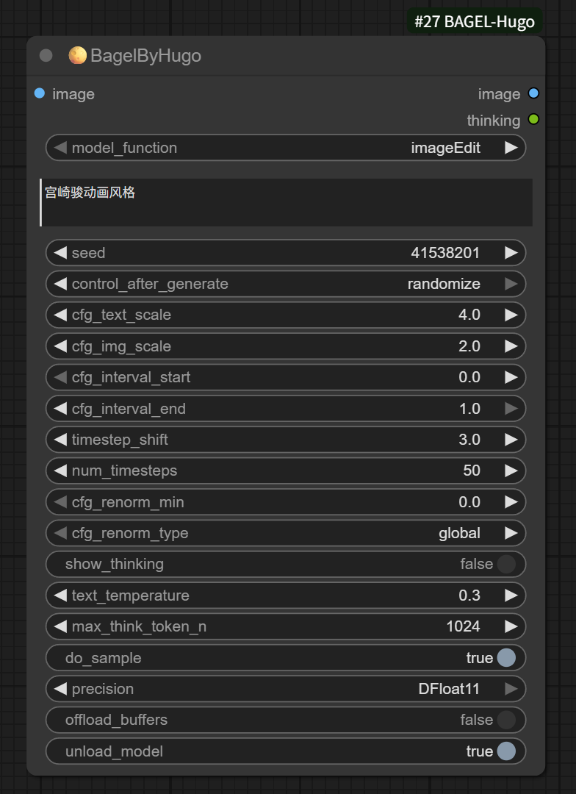
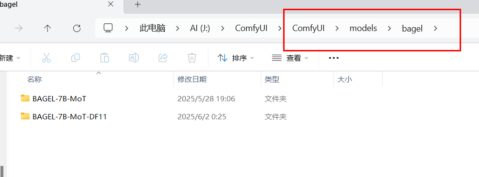
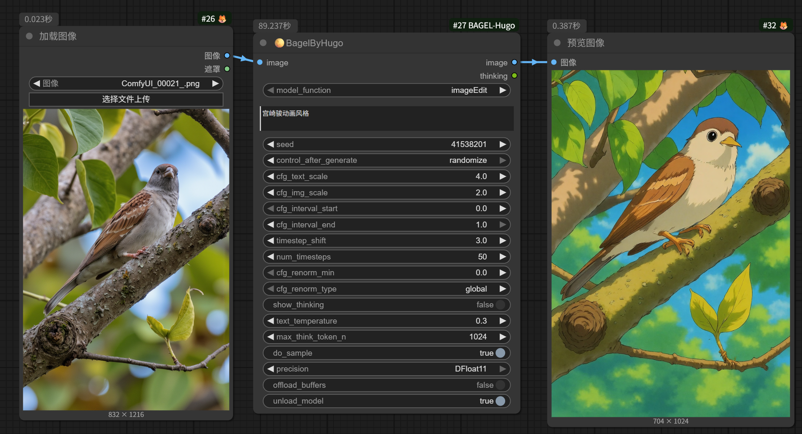
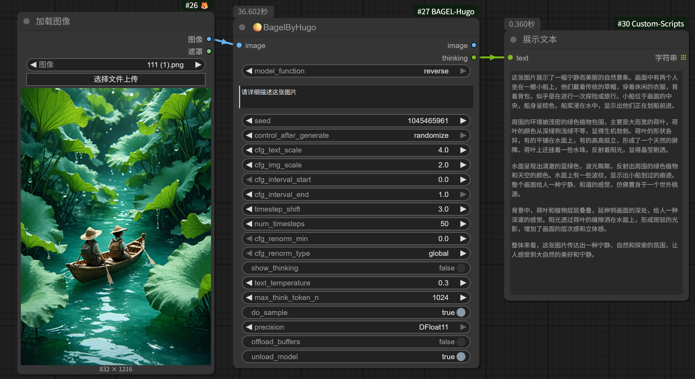

<h1 align="center">ComfyUI-BAGEL-Hugo</h1>

      English | <a href="README.md">中文</a>

## Introduction

This repository encapsulates the BAGEL model as ComfyUI nodes for use, including image editing and image inversion features, but it does not include text-to-image functionality. 

## Installation 

#### Method 1:

1. Go to comfyUI custom_nodes folder, `ComfyUI/custom_nodes/`
2. `git clone https://github.com/MoonHugo/ComfyUI-BAGEL-Hugo.git`
3. `cd ComfyUI-BAGEL-Hugo`
4. `pip install -r requirements.txt`
5. restart ComfyUI

#### Method 2:
Directly download the node source package, then extract it into the custom_nodes directory, and finally restart ComfyUI.

#### Method 3：
Install through ComfyUI-Manager by searching for 'ComfyUI-BAGEL-Hugo' and installing it.

## Nodes introduction

**model_function**: The model's functionalities are divided into "imageEdit" (image editing) and "reverse" (prompt inversion), but it does not include text-to-image generation. 
**image**: Input image. 
**prompt**: Command prompt. 
**seed**: Integer type, used to set a seed value for ensuring reproducible results. The value range is between 0 and 2³² − 1. 
**cfg_text_scale**: Controls how strongly the model follows the text prompt. 1.0 disables text guidance. Typical range: 4.0–8.0. 
**cfg_img_scale**: Controls how much the model preserves input image details. 1.0 disables image guidance. Typical range: 1.0–2.0. 
**cfg_interval_start**: Start timestep for applying Classifier Free Guidance (CFG). 0.0 means CFG is applied from the first step. 1.0 means CFG is applied at the last step. Typical: 0.0 
**cfg_interval_end**: End timestep for applying Classifier Free Guidance (CFG). 0.0 means CFG is applied at the end of the first step. 1.0 means CFG is applied at the end of the last step. Typical: 1.0 
**timestep_shift**: Shifts the distribution of denoising steps. Higher values allocate more steps at the start (affects layout); lower values allocate more at the end (improves details). 
**num_timesteps**: Total denoising steps. Typical: 50. 
**cfg_renorm_min**:Minimum value for CFG-Renorm. 1.0 disables renorm. Typical: 0. 
**cfg_renorm_type**: CFG-Renorm method，There are three options: global, channel, and text_channel.global: Normalize over all tokens and channels (default for T2I).channel: Normalize across channels for each token.text_channel: Like channel, but only applies to text condition (good for editing, may cause blur). 
**show_thinking**: Whether to show the thinking process. Enabling this option will display the model's thinking process during inference. 
**text_temperature**: Controls randomness in text generation. Lower values make the output more deterministic, higher values make it more random. 
**max_think_token_n**: Maximum number of tokens generated during the thinking process. Higher values may lead to longer thinking processes but increase computational load. 
**do_sample**: Whether to use sampling in text generation. Enabling this option can make the generated text more diverse. 
**precision**: Select the precision for the model. BFloat16 offers higher precision but requires more GPU memory. DFloat11 is a memory-efficient precision that reduces the model size by 32% compared to the original BFloat16 model, while generating consistent outputs and running efficiently on GPUs. 
**offload_buffers**: Whether to offload data from GPU memory to CPU memory. Enabling this option can save GPU memory but may slow down inference speed. 
**unload_model**: Whether to unload the model after inference. Enabling this option can free GPU memory but will reload the model for the next inference. 
___

## Usage

First, manually download the model and place it in the models/bagel directory. The model download address is:：[BAGEL-7B-MoT](https://huggingface.co/ByteDance-Seed/BAGEL-7B-MoT)、[BAGEL-7B-MoT-DF11](https://huggingface.co/DFloat11/BAGEL-7B-MoT-DF11) 

___
Using of the imageEdit.json Workflow 

___
Usage of the image2text.json Workflow 

___
## Social Account Homepage
- Bilibili：[My BILIBILI Homepage](https://space.bilibili.com/1303099255)

## Acknowledgments

Thanks to all the authors of the Bagel repository. [ByteDance-Seed/Bagel](https://github.com/ByteDance-Seed/Bagel)

## Acknowledgments

